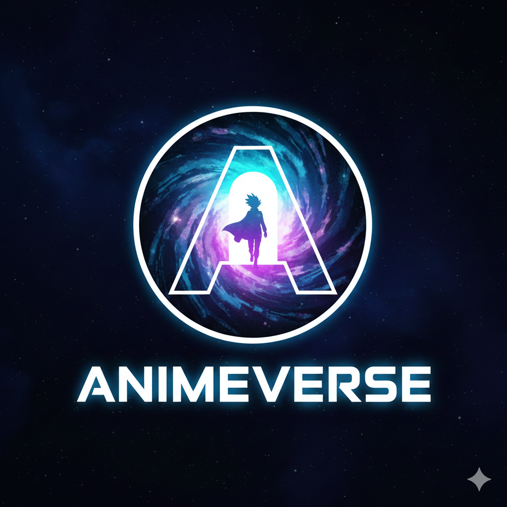

# AnimeVerse 🎌

Your ultimate destination for anime discovery, tracking, and community engagement.



## 🌟 Features

- **Discover Anime**: Browse thousands of anime titles with powerful search and filtering
- **Track Progress**: Maintain your watchlist with watching, completed, plan-to-watch, and dropped lists
- **Personalized Recommendations**: Get tailored anime suggestions based on your preferences
- **Top & Seasonal**: Explore top-rated anime and seasonal releases
- **Manga Support**: Browse and discover manga titles
- **Character Database**: Detailed character information with voice actors
- **User Profiles**: Customize your profile and track your anime statistics
- **Reviews & Comments**: Share your thoughts and engage with the community
- **Responsive Design**: Optimized for desktop, tablet, and mobile devices

## 🚀 Tech Stack

### Frontend
- **React 18** - UI library
- **Vite** - Build tool
- **Tailwind CSS** - Styling
- **Framer Motion** - Animations
- **Axios** - HTTP client
- **React Router** - Navigation

### Backend
- **Node.js & Express** - Server framework
- **MongoDB & Mongoose** - Database
- **JWT** - Authentication
- **Bcrypt** - Password hashing
- **Express Rate Limit** - API protection
- **Helmet** - Security headers

### External APIs
- **Jikan API v4** - MyAnimeList data

## 📦 Installation

### Prerequisites
- Node.js (v16 or higher)
- MongoDB (local or Atlas)
- npm or yarn

### Backend Setup

1. Navigate to Backend folder:
```bash
cd Backend
```

2. Install dependencies:
```bash
npm install
```

3. Create `.env` file:
```env
MONGO_URI=your_mongodb_connection_string
JWT_SECRET=your_jwt_secret_key
PORT=3000
NODE_ENV=development
JIKAN_API_URL=https://api.jikan.moe/v4
FRONTEND_URL=http://localhost:5173
```

4. Start the server:
```bash
npm run dev
```

### Frontend Setup

1. Navigate to Frontend folder:
```bash
cd Frontend
```

2. Install dependencies:
```bash
npm install
```

3. Create `.env` file:
```env
VITE_API_URL=http://localhost:3000/api
```

4. Start development server:
```bash
npm run dev
```

## 🌐 Deployment

### Frontend (Vercel)

1. Push code to GitHub
2. Import project in Vercel
3. Set build settings:
   - **Framework Preset**: Vite
   - **Build Command**: `npm run build`
   - **Output Directory**: `dist`
4. Add environment variable:
   - `VITE_API_URL`: Your backend API URL

### Backend (Vercel/Railway/Render)

#### Vercel:
1. Import Backend folder as separate project
2. Add environment variables (all from `.env`)
3. Deploy

#### Railway/Render:
1. Connect GitHub repository
2. Set root directory to `Backend`
3. Add environment variables
4. Deploy

## 📝 Environment Variables

### Backend
```
MONGO_URI=mongodb://...
JWT_SECRET=random_secure_string
PORT=3000
NODE_ENV=production
JIKAN_API_URL=https://api.jikan.moe/v4
FRONTEND_URL=https://your-frontend-url.vercel.app
```

### Frontend
```
VITE_API_URL=https://your-backend-url.vercel.app/api
```

## 🛠️ Available Scripts

### Backend
- `npm start` - Start production server
- `npm run dev` - Start development server with nodemon

### Frontend
- `npm run dev` - Start development server
- `npm run build` - Build for production
- `npm run preview` - Preview production build

## 📚 API Endpoints

### Authentication
- `POST /api/auth/register` - Register new user
- `POST /api/auth/login` - Login user
- `GET /api/auth/me` - Get current user
- `PUT /api/auth/profile` - Update profile

### Anime
- `GET /api/anime` - Get all anime (with filters)
- `GET /api/anime/search` - Search anime
- `GET /api/anime/top` - Get top anime
- `GET /api/anime/seasonal/:year/:season` - Get seasonal anime
- `GET /api/anime/:id` - Get anime details
- `GET /api/anime/:id/characters` - Get anime characters
- `GET /api/anime/:id/reviews` - Get anime reviews
- `GET /api/anime/:id/recommendations` - Get recommendations

### Watchlist
- `GET /api/watchlist` - Get user watchlist
- `POST /api/watchlist` - Add to watchlist
- `PUT /api/watchlist/:id` - Update watchlist item
- `DELETE /api/watchlist/:id` - Remove from watchlist
- `GET /api/watchlist/stats` - Get user stats

### Manga
- `GET /api/manga` - Get all manga
- `GET /api/manga/top` - Get top manga
- `GET /api/manga/:id` - Get manga details

## 🎨 Features Showcase

- **Dark Theme**: Eye-friendly dark mode design
- **Infinite Scroll**: Seamless browsing experience
- **Lazy Loading**: Optimized image loading
- **Skeleton Screens**: Better loading states
- **Responsive Navigation**: Dropdown menus for organized navigation
- **Rate Limiting**: Protection against API abuse
- **Error Boundaries**: Graceful error handling
- **Toast Notifications**: User feedback for actions

## 🔒 Security Features

- JWT authentication with httpOnly cookies
- Password hashing with bcrypt
- Helmet.js for security headers
- Rate limiting on API endpoints
- Input validation and sanitization
- CORS configuration
- XSS protection

## 📄 License

This project is open source and available under the [MIT License](LICENSE).

## 🤝 Contributing

Contributions, issues, and feature requests are welcome!

## 📧 Contact

For questions or support, please contact: support@animeverse.com

## 🙏 Acknowledgments

- Data provided by [MyAnimeList](https://myanimelist.net) via [Jikan API](https://jikan.moe)
- Icons from [Heroicons](https://heroicons.com)
- Animations by [Framer Motion](https://www.framer.com/motion)

---

Made with ❤️ for anime fans worldwide
